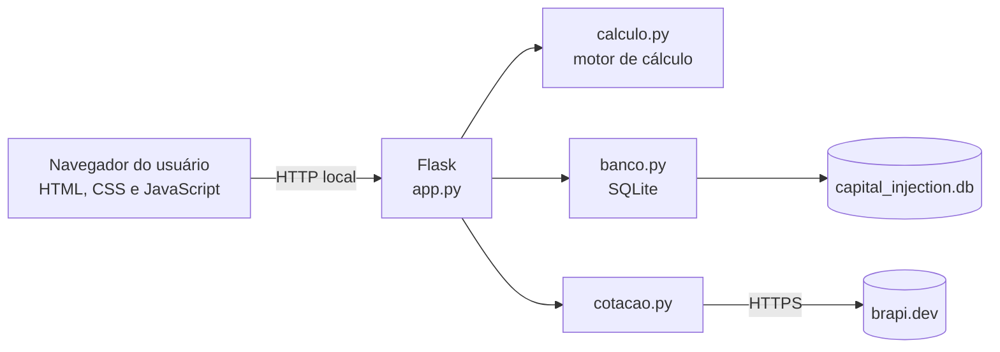

# 4. Arquitetura e Integrações

## 4.1. Visão Geral

O Capital Injection é uma aplicação **local**: roda no computador do usuário, abre no navegador em `http://127.0.0.1:5000` e guarda os dados em um arquivo SQLite. Não é um site publicado e não tem outros usuários. Esta arquitetura substitui a solução em Excel e Power BI do PI3 (ver seção 4.7).



Princípio de projeto: o **motor de cálculo não sabe nada de banco, API ou tela**. Ele recebe dados e devolve resultados, o que permite testá-lo isoladamente contra os números do Excel (seção 6).

## 4.2. Tecnologias Utilizadas

| Camada | Tecnologia | Motivo |
|---|---|---|
| Linguagem e backend | Python 3 com Flask | Simples, uma linguagem só no servidor, fácil de rodar localmente. |
| Interface | HTML, CSS e JavaScript sem framework | Uma página única não justifica framework. |
| Banco de dados | SQLite (módulo `sqlite3` do Python) | Vem embutido no Python, sem instalação, arquivo único, transações atômicas e consultas SQL para o histórico. |
| Cálculos financeiros | `decimal.Decimal` | Evita erros de ponto flutuante (RNF03). |
| Cotações | API brapi.dev, via biblioteca `requests` | Cobre Ações, FIIs e ETFs da B3, com plano gratuito. |
| Testes | `pytest` | Valida o motor contra os cenários da seção 6. |
| Gestão do projeto | GitHub (Issues, Milestones, Projects em Kanban) | Exigência da disciplina. |

## 4.3. Modelo de Dados (SQLite)

**Tabela `ativos`**

| Coluna | Tipo | Observação |
|---|---|---|
| `ticker` | TEXT, chave primária | Ex.: ITSA4, "CDB Banco X" |
| `tipo` | TEXT | `Acao`, `FII`, `ETF`, `RendaFixa` ou `Cripto` |
| `qtd` | TEXT (decimal) | Renda Fixa: sempre 1 |
| `preco_atual` | TEXT (decimal) | Renda Fixa: saldo atual em R$ |
| `pct_alvo` | TEXT (decimal) | Guardado como fração, ex.: `0.25` |
| `preco_origem` | TEXT | `api` ou `manual` |
| `atualizado_em` | TEXT (data e hora) | Momento do último preço |

**Tabela `historico`**

| Coluna | Tipo | Observação |
|---|---|---|
| `id` | INTEGER, chave primária | Autoincremento |
| `data` | TEXT | Data da consolidação |
| `ticker` | TEXT | |
| `qtd_comprada` | TEXT (decimal) | |
| `preco` | TEXT (decimal) | Preço usado na compra |
| `valor_investido` | TEXT (decimal) | |

Valores monetários são guardados como texto decimal e convertidos para `Decimal` no código, para não perder precisão.

## 4.4. Integração com a API de Cotações (brapi.dev)

| Item | Detalhe |
|---|---|
| Endpoint | `GET https://brapi.dev/api/quote/{tickers}` (vários tickers separados por vírgula) |
| Campo usado | `regularMarketPrice` de cada item em `results` |
| Autenticação | Token no cabeçalho `Authorization: Bearer <token>` (ou parâmetro `?token=`) |
| Plano gratuito | Exige conta e token; PETR4, MGLU3, VALE3 e ITUB4 funcionam sem token (útil para testes) |
| Onde fica o token | Variável `BRAPI_TOKEN` no arquivo `.env`, que **não** vai para o GitHub. O repositório traz apenas `.env.example`. |
| Chamada | Sempre feita pelo backend (Flask), nunca pelo JavaScript do navegador |
| Falha da API | O sistema usa o último preço salvo no banco, avisa o usuário e permite digitar o preço manualmente (RNF04) |
| Renda Fixa e Cripto | No MVP, preço ou saldo é informado manualmente. Cotação automática de cripto é evolução futura. |

## 4.5. Estrutura de Código

```
capital-injection/
├── app.py                 rotas do Flask (liga tudo)
├── calculo.py             motor de cálculo (funções puras, sem banco nem API)
├── banco.py               acesso ao SQLite (ativos, histórico, consolidar)
├── cotacao.py             consulta à brapi com tratamento de falha
├── templates/index.html   página única
├── static/                app.js e style.css
├── tests/                 test_calculo.py, test_banco.py
├── docs/                  esta documentação
├── requirements.txt
├── .env.example           modelo do arquivo de configuração (sem o token real)
└── .gitignore             ignora .env, .venv e o arquivo .db
```

## 4.6. Rotas HTTP

| Rota | O que faz |
|---|---|
| `GET /` | Entrega a página |
| `GET /api/carteira` | Lista os ativos salvos |
| `POST /api/ativos` | Cadastra ou edita um ativo |
| `DELETE /api/ativos/<ticker>` | Remove um ativo |
| `POST /api/calcular` | Recebe o aporte e devolve o ranking, sem gravar nada |
| `POST /api/consolidar` | Recebe o aporte, recalcula e consolida (RN07) |
| `GET /api/historico` | Lista o histórico de aportes |
| `POST /api/cotacoes/atualizar` | Busca preços na brapi e atualiza os ativos |

## 4.7. Decisão de Arquitetura e Arquitetura Anterior

A migração e a escolha do SQLite estão registradas no ADR 001 (issue #88 do repositório). Resumo:

- **Por que sair do Excel e Power BI:** a interface em Power BI só visualiza, sem lógica nem entrada de dados; Power Apps e AppSheet foram testados como interface sobre a planilha e não atenderam.
- **Por que SQLite e não Supabase:** o sistema roda localmente e tem um único usuário. Um banco na nuvem traria conta externa, chave de API e dependência de internet sem nenhum benefício. Se o projeto virar um site publicado, a camada `banco.py` é o único ponto a trocar.

Arquitetura do PI3, mantida como histórico:

| Camada | Tecnologia |
|---|---|
| Motor de cálculo e banco | Microsoft Excel (fórmulas nativas e macro VBA de consolidação) |
| Visualização | Power BI (DAX e Power Query M) |
| Cotações | Função de dados financeiros do Google Finance |
| Prototipação | Figma |
