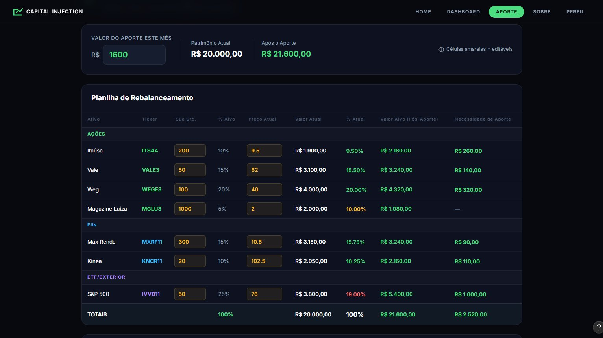
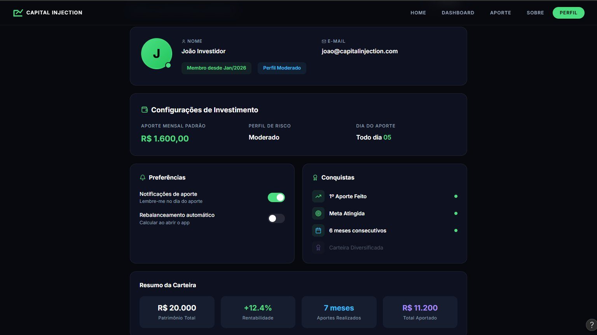

# 5. Interface e Prototipação

Esta seção apresenta os protótipos de alta fidelidade do Capital Injection, feitos no Figma no PI3, e define o que entra na primeira versão em código (MVP). As telas foram concebidas com foco na Usabilidade (RNF01): interface limpa, mínimo de campos e saída clara.

Protótipo interativo no Figma: [Design Screens for Capital Injection](https://www.figma.com/community/file/1629261141093957791/design-screens-for-capital-injection)

## 5.1. Tela Inicial (Home)

*Figura 1: Tela inicial, com apresentação da proposta de valor e acesso rápido às funcionalidades.*

## 5.2. Tela de Aporte (Planilha de Rebalanceamento)

*Figura 2: Tela principal de aporte, onde o usuário insere o valor mensal e visualiza a planilha de rebalanceamento com a necessidade de aporte calculada por ativo.*

Esta é a tela que define o MVP. Os números da Figura 2 (aporte de R$ 1.600,00 sobre uma carteira de R$ 20.000,00) são usados como caso de teste na seção 6 (Caso B).

## 5.3. Tela de Perfil

*Figura 3: Tela de perfil do usuário, com configurações de investimento, preferências e resumo da carteira.*

## 5.4. Escopo da Interface em Código (esqueleto da calculadora)

A versão atual em código é o **esqueleto da calculadora**: uma única página em estilo planilha, com a regra de cores da planilha original (laranja é o que o usuário digita, azul é calculado ou vem da API). A interface final e as novas funcionalidades vêm depois. Home, Dashboard, Sobre e Perfil ficam para depois.

**Elementos da página:**

| Elemento | Comportamento |
|---|---|
| Valor do aporte | Campo em R$ (RF01), com os botões Calcular, Consolidar Aporte e Atualizar cotações ao lado |
| Planilha de input | Colunas: Ticker, Preço Atual (vem da API), Qtd. (editável), Em carteira, % Alvo (editável), % Atual e Defasagem. Só bolsa por enquanto: o tipo do ativo não aparece e é sempre "Ação" |
| Adicionar e remover ativo | Linha de cadastro com ticker, quantidade e % Alvo (o preço vem da brapi; ticker não encontrado não é salvo) e um "x" por linha para remover |
| Linha de totais | Valor em carteira e soma do % Alvo, em vermelho quando a soma não é 100% (RN03), com o cálculo bloqueado |
| Planilha de Resultados | Colunas: Ticker, Aporte Recomendado, Qtd. a comprar e Sobra, ordenada pela maior defasagem. Ativos sem aporte mostram "-". A linha de total soma o aporte e as sobras |
| Consolidar Aporte | Confirma o aporte, atualiza quantidades e grava o histórico (RN07) |
| Atualizar cotações | Busca os preços na API (seção 4.4) |
| Histórico de aportes | Agrupado em blocos por aporte, com data, ticker, quantidade, preço e valor investido (RF12). Permite editar, excluir (linha ou bloco inteiro) e adicionar linhas à mão, sempre ajustando a carteira, além de Desfazer e Refazer |

**Fora do escopo do MVP:** login, gráficos, tema claro, telas de Home, Dashboard, Sobre e Perfil, importação de arquivos.
