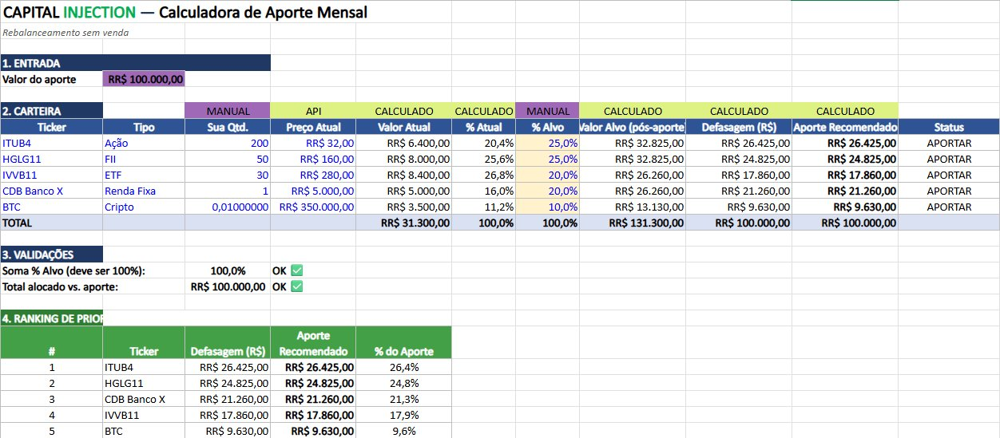

# 7. Implementação: Motor de Cálculo (MVP)

## 7.1. Estado Herdado do PI3 (Excel)

No PI3, o motor de cálculo foi desenvolvido em Microsoft Excel e serve de **gabarito** para a versão em código: os números da planilha devem ser reproduzidos exatamente pelo Python (seção 6, Casos A e B).

A planilha era organizada em quatro blocos: (1) Entrada do valor do aporte mensal; (2) Carteira, com ativos, percentuais alvo e cálculos automáticos de valor atual, percentual atual, valor alvo pós-aporte, defasagem e aporte recomendado; (3) Validações, que verificam a soma de 100% (RN03) e o total alocado contra o aporte; e (4) Ranking de Prioridade, ordenado pela defasagem (RN04). Uma macro VBA de consolidação atualizava as quantidades e gravava a aba Histórico.



*Figura 4: Motor de cálculo no Microsoft Excel (PI3), com a entrada do aporte, a carteira, as validações e o ranking de prioridade. É o Caso A da seção 6.*

## 7.2. Implementação em Código (PI4)

O motor foi reescrito em Python, com as mesmas regras e fórmulas (seção 3), e acrescido de persistência, consolidação e histórico. O status atual é atualizado a cada sprint:

| Parte | Issue | Sprint | Situação |
|---|---|---|---|
| Ambiente e esqueleto do projeto | #82 | 09 | Feita |
| Motor de cálculo em Python, validado contra o Excel | #83 | 10 | Feita |
| Cotação de ativos via brapi.dev | #84 | 10 | Feita |
| Tela de entrada e visualização | #85 | 11 | Feita |
| Consolidação de aporte e histórico (SQLite) | #86 | 11 | Feita |
| Testes completos e validação | #87 | 12 | A fazer |

## 7.3. Ordem de Construção

1. **Esqueleto:** pastas, `requirements.txt`, `.gitignore`, `.env.example`; o comando `python app.py` já abre uma página vazia.
2. **Motor de cálculo (`calculo.py`):** funções puras, sem banco e sem tela. Pronto quando todos os casos da seção 6.2 passam em `pytest`.
3. **Banco (`banco.py`):** tabelas da seção 4.3, cadastro de ativos e a função de consolidar, atômica. Pronto quando CT04, CT05 e CT06 passam.
4. **Tela:** página única da seção 5.4, ligada às rotas da seção 4.6. Pronto quando o fluxo completo funciona no navegador: cadastrar ativos, calcular, consolidar e ver o histórico.
5. **Cotações (`cotacao.py`):** brapi com preço manual de reserva. Pronto quando CT07 passa.

Regra de ouro: cada etapa termina com testes passando, um commit e um push.

## 7.4. Como Rodar

```
python -m venv .venv
.venv\Scripts\activate          (Windows)
pip install -r requirements.txt
copy .env.example .env          (depois preencha BRAPI_TOKEN)
python app.py                   (abra http://127.0.0.1:5000)
pytest                          (roda os testes)
```

## 7.5. Definição de Pronto (demo)

- O programa abre com um comando e mostra a carteira salva.
- Ao digitar um aporte e calcular, os números batem com o Excel (Casos A e B).
- "Consolidar Aporte" atualiza as quantidades e grava o histórico; fechando e abrindo de novo, tudo continua lá.
- Sem internet, o sistema avisa e permite preço manual.
- Todos os testes da seção 6 passam.
